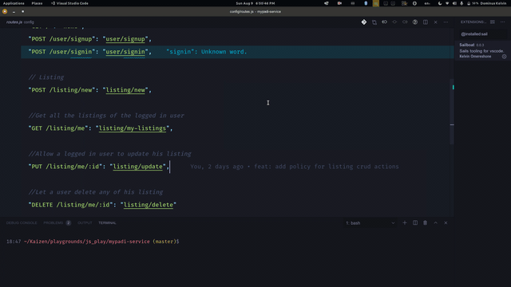

# Sailboat ⛵

Sails tooling for vscode. I daily use Sailboat features in my workflow with [sails](https://sailsjs.com). I believe it can make you also more productive with Sails.

## Demo time 😌

# Installation

1. Open the **Extensions** sidebar in VS Code. `View → Extensions`
2. Search for `sailboat`, choose "Sailboat" by **Kelvin Omereshone**
3. Click **Install** to install it

## Features ⌛
- Commands to get to Sails docs
- Commands to lift sails in all 3 modes (default, verbose and silly)
- Jump to Action (Ctrl|Cmd + click to navigate from a route to a respective action file.)

### Coming Soon ⏳
- Jump to helper
- Intellisense

### Accessing Sailboat commands 💪
Press ctrl + shift + p or cmd + shift + p to access VSCode command pallette. Then type 'sailboat' to see the list of available commands

## License

This theme is released under the [MIT License](https://github.com/DominusKelvin/sailboat/blob/master/LICENSE.md).

Created by **[DominusKelvin](https://github.com/DominusKelvin)** in **[Agbor, Nigeria](https://www.google.com.ng/maps/place/Agbor)**. Go follow me on **[Twitter](https://twitter.com/dominus_kelvin)**!
